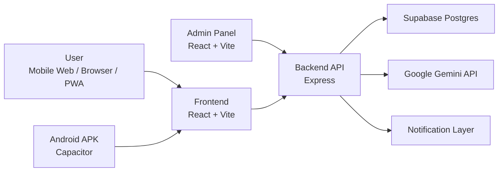
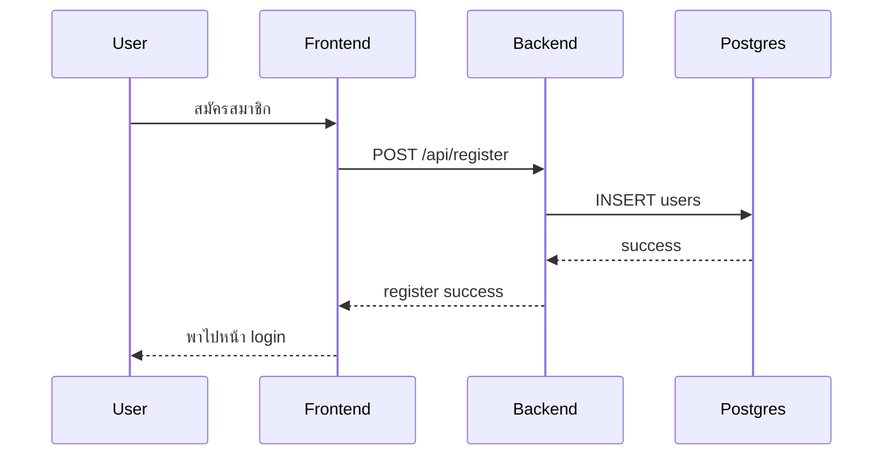
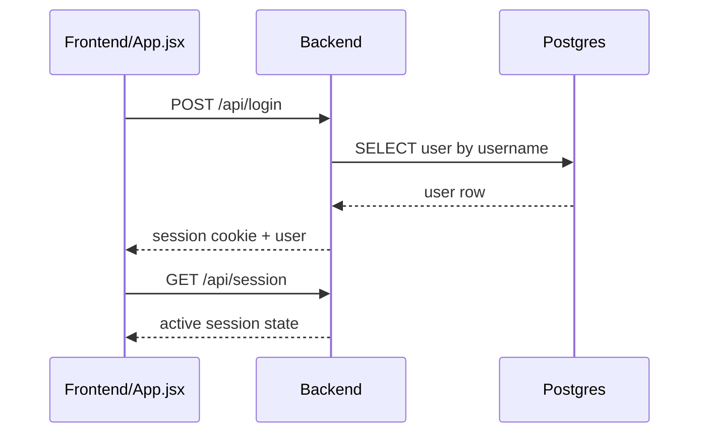
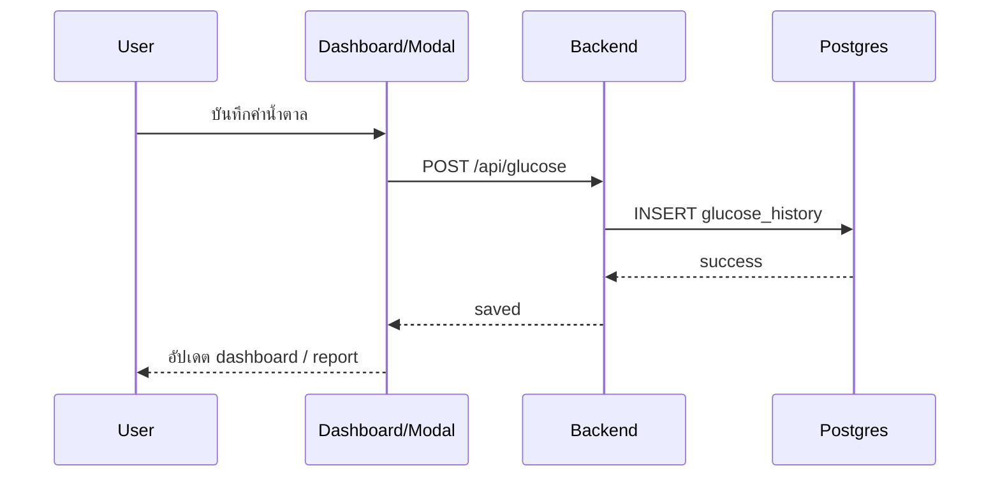
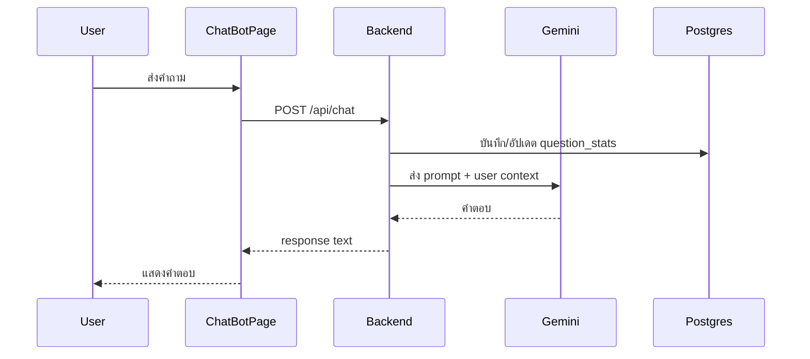
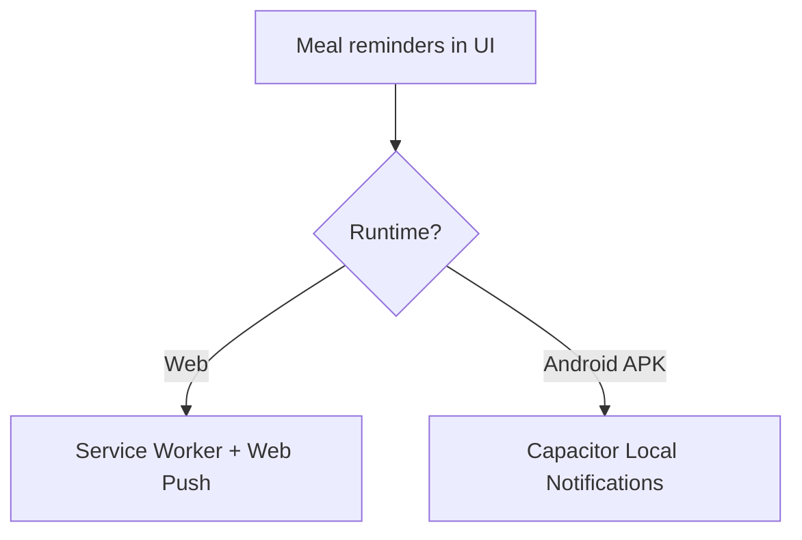
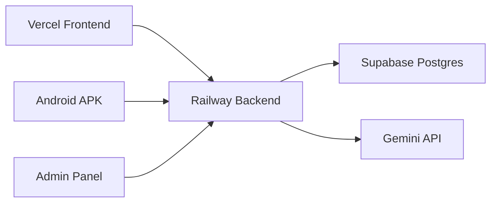

# System Architecture

## 1. Overview

`Today Care` เป็นระบบดูแลสุขภาพสำหรับผู้ป่วยเบาหวาน โดยมี 4 ส่วนหลัก:

1. `Frontend` สำหรับผู้ใช้งานทั่วไป
2. `Backend API` สำหรับ business logic และการเชื่อม AI / database
3. `Admin Panel` สำหรับดูสถิติการใช้งาน
4. `Android App (APK)` ที่ครอบ frontend ผ่าน Capacitor

สถาปัตยกรรมหลักเป็นแบบ `client-server` โดยให้ frontend, admin panel, และ APK เรียกใช้งาน API ชุดเดียวกัน

## 2. Repository Structure

### Root

- [package.json](C:/my-chat-bot/package.json)
  ใช้รวมคำสั่งหลักของโปรเจ็กต์ เช่น build frontend, sync Android, เปิด Android Studio
- [capacitor.config.ts](C:/my-chat-bot/capacitor.config.ts)
  config สำหรับ build แอป Android จาก frontend
- [vercel.json](C:/my-chat-bot/vercel.json)
  config สำหรับ deploy frontend ไป Vercel
- [RAILWAY_BACKEND_DEPLOY.md](C:/my-chat-bot/RAILWAY_BACKEND_DEPLOY.md)
  เอกสาร deploy backend ไป Railway
- [VERCEL_DEPLOY.md](C:/my-chat-bot/VERCEL_DEPLOY.md)
  เอกสาร deploy frontend ไป Vercel

### Frontend

- [frontend/src/App.jsx](C:/my-chat-bot/frontend/src/App.jsx)
  app shell หลัก, auth flow, navigation, reminders, chat entry, session handling
- [frontend/src/config.js](C:/my-chat-bot/frontend/src/config.js)
  จุดกำหนด `API_URL`
- [frontend/src/components](C:/my-chat-bot/frontend/src/components)
  หน้าหลักทั้งหมดของผู้ใช้ เช่น login, register, dashboard, chat, report, profile
- [frontend/src/utils](C:/my-chat-bot/frontend/src/utils)
  validation และ native notification helper
- [frontend/src/data](C:/my-chat-bot/frontend/src/data)
  ชุดหัวข้อและ quick prompts สำหรับ AI
- [frontend/public/sw.js](C:/my-chat-bot/frontend/public/sw.js)
  service worker สำหรับ web push ฝั่งเว็บ
- [frontend/public/manifest.webmanifest](C:/my-chat-bot/frontend/public/manifest.webmanifest)
  PWA manifest

### Backend

- [backend/server.js](C:/my-chat-bot/backend/server.js)
  API server หลัก, auth, session, glucose, reminders, admin stats, AI chat, push
- [backend/database.js](C:/my-chat-bot/backend/database.js)
  database layer สำหรับ Postgres / Supabase
- [backend/scripts/migrate-sqlite-to-postgres.js](C:/my-chat-bot/backend/scripts/migrate-sqlite-to-postgres.js)
  migration script สำหรับย้ายข้อมูลจาก SQLite เดิมไป Postgres
- [backend/.env.example](C:/my-chat-bot/backend/.env.example)
  ตัวอย่าง environment variables

### Admin Panel

- [admin-panel/src/App.jsx](C:/my-chat-bot/admin-panel/src/App.jsx)
  dashboard หลักของฝั่งแอดมิน
- [admin-panel/src/config.js](C:/my-chat-bot/admin-panel/src/config.js)
  config สำหรับเชื่อม backend API
- [admin-panel/src/components](C:/my-chat-bot/admin-panel/src/components)
  chart panels และ UI ของแอดมิน

### Android

- [android](C:/my-chat-bot/android)
  native Android project ที่ Capacitor generate ให้
- [ANDROID_APP_BUILD.md](C:/my-chat-bot/ANDROID_APP_BUILD.md)
  วิธี build APK

## 3. Main Runtime Architecture

### 3.1 Frontend Layer

Frontend ถูกสร้างด้วย `React + Vite` และออกแบบให้เป็น `mobile-first app-like UI`

หน้าหลักที่สำคัญ:

- `Login`
- `Register`
- `Profile Setup`
- `Dashboard`
- `ChatBotPage`
- `WeeklyReportPage`
- `EditProfilePage`
- `CategoryDetailPage`

หน้าทั้งหมดถูกควบคุมจาก [App.jsx](C:/my-chat-bot/frontend/src/App.jsx) โดยใช้ state navigation ภายในแอป และ sync กับ browser history เพื่อให้ปุ่ม back บนมือถือทำงานเหมือนแอปจริง

### 3.2 Backend Layer

Backend ใช้ `Express` ทำหน้าที่:

- authentication / session
- profile management
- glucose logging
- weekly summary data source
- meal reminder persistence
- AI chat routing
- push subscription management
- admin analytics

backend ยังเป็นตัวกลางระหว่าง:

- frontend กับ database
- frontend กับ Gemini API
- frontend กับ web push / native notification flow

### 3.3 Database Layer

database หลักคือ `Supabase Postgres`

ตารางหลักใน [database.js](C:/my-chat-bot/backend/database.js):

- `users`
- `glucose_history`
- `question_stats`
- `meal_reminders`
- `push_subscriptions`

backend จะสร้างตารางเหล่านี้อัตโนมัติถ้ายังไม่มี

## 4. Authentication and Session Flow

ระบบ auth ปัจจุบันใช้ `session cookie` ที่ backend เซ็นด้วย `SESSION_SECRET`

flow:

1. ผู้ใช้สมัครสมาชิกผ่าน `/api/register`
2. ผู้ใช้ล็อกอินผ่าน `/api/login`
3. backend สร้าง session cookie
4. frontend เรียก `/api/session` เพื่อตรวจสถานะ
5. เมื่อ logout จะล้าง session

แนวคิด:

- frontend ไม่ควรถือ auth state เองเป็นหลัก
- backend เป็นผู้ตรวจ session จริง
- cookie ใช้ `SameSite` / `Secure` ตาม environment production

## 5. Core User Flows

### 5.1 Registration Flow

หมายเหตุ:

- ตอนสมัครใช้แค่ `username + password`
- ชื่อจริงและข้อมูลสุขภาพไปกรอกใน `Profile Setup` ภายหลัง

### 5.2 Login and Session Restore

### 5.3 Glucose Logging Flow

### 5.4 AI Chat Flow

### 5.5 Reminder Flow

มี 2 เส้นทางขึ้นกับ runtime

#### Web / Browser

- frontend ขอสิทธิ์ notification
- service worker รับ push
- backend เก็บ push subscription
- backend ส่ง push ตามเวลาอาหาร

#### Android APK

- frontend ตรวจว่าเป็น native Android
- ใช้ [nativeNotifications.js](C:/my-chat-bot/frontend/src/utils/nativeNotifications.js)
- schedule ผ่าน `@capacitor/local-notifications`
- ทำงานบนเครื่องโดยตรง

## 6. Admin Analytics Flow

Admin panel ใช้ API เดียวกับ backend

flow:

1. admin panel โหลดข้อมูลจาก `/api/admin/stats`
2. backend ดึง `question_stats`
3. admin panel จัดกลุ่มเป็น intent และวาด chart

หมายเหตุ:

- ตอนนี้ตั้งใจให้ใช้งานง่ายก่อน
- ยังไม่ได้ทำ admin auth แยกแบบเต็มรูปแบบ

## 7. Notification Architecture

### Web notification path

- [frontend/public/sw.js](C:/my-chat-bot/frontend/public/sw.js)
- backend ใช้ `web-push`
- ต้องมี:
  - `VAPID_SUBJECT`
  - `VAPID_PUBLIC_KEY`
  - `VAPID_PRIVATE_KEY`

### Android notification path

- ใช้ `@capacitor/local-notifications`
- helper อยู่ที่ [nativeNotifications.js](C:/my-chat-bot/frontend/src/utils/nativeNotifications.js)
- Android permission ตั้งใน manifest ของ project Android

## 8. Deployment Architecture

production ตอนนี้แยกเป็น:

- `Frontend`: Vercel
- `Backend`: Railway
- `Database`: Supabase Postgres
- `AI`: Google Gemini API

### API URL strategy

- frontend อ่านจาก [frontend/src/config.js](C:/my-chat-bot/frontend/src/config.js)
- admin panel อ่านจาก [admin-panel/src/config.js](C:/my-chat-bot/admin-panel/src/config.js)
- production ใช้ `VITE_API_URL`

## 9. Android App Architecture

Android app ไม่ได้มี backend แยกของตัวเอง

แนวคิดคือ:

- frontend ถูก build เป็น static web assets
- Capacitor นำ assets เหล่านี้ไปแสดงใน native WebView
- app จึงยังเรียก API ไป Railway backend เหมือนเว็บ

ดู config ได้ที่ [capacitor.config.ts](C:/my-chat-bot/capacitor.config.ts)

ดังนั้น data flow คือ:

`APK -> Frontend WebView -> Railway Backend -> Supabase`

## 10. Environment Variables

ค่าหลักที่ระบบพึ่งพา:

### Backend

- `SUPABASE_DB_URL`
- `GEMINI_API_KEY`
- `SESSION_SECRET`
- `ALLOWED_ORIGINS`
- `SESSION_COOKIE_SAME_SITE`
- `SESSION_COOKIE_SECURE`
- `VAPID_SUBJECT`
- `VAPID_PUBLIC_KEY`
- `VAPID_PRIVATE_KEY`

### Frontend

- `VITE_API_URL`

## 11. Current Architectural Strengths

- แยก frontend / backend / database ชัดเจน
- รองรับทั้ง web และ Android APK จาก codebase เดียว
- ใช้ Postgres แล้ว เหมาะกับ production มากกว่า SQLite เดิม
- notification architecture แยกตาม runtime ได้เหมาะสม
- frontend และ admin panel build แยกกัน ทำให้ deploy ยืดหยุ่น

## 12. Current Architectural Tradeoffs

- admin panel ยังใช้ API เดียวกับระบบหลักและยังไม่มี admin auth เต็มรูปแบบ
- web notification กับ Android native notification มี 2 เส้นทาง ต้องดูแลให้ messaging สอดคล้องกัน
- navigation ฝั่งผู้ใช้เป็น app-style state navigation ภายใน React ไม่ได้ใช้ full router
- project ใช้โฟลเดอร์ `frontend` เป็นมาตรฐานเดียวกันใน config, deploy, และเอกสาร

## 13. Recommended Future Evolution

ถ้าจะขยายระบบต่อ แนะนำลำดับนี้:

1. เพิ่ม `admin auth` และแยกสิทธิ์ให้ชัด
2. เพิ่ม monitoring / logging สำหรับ production
3. เพิ่ม test coverage ของ auth, glucose, reminders, chat
4. ทำ release signing flow สำหรับ Android APK
5. ถ้าระบบโตขึ้น ค่อยแยก backend เป็น service modules ชัดขึ้น เช่น auth, health, chat, notifications

## 14. Summary

ระบบนี้เป็น `health assistant platform` แบบ full-stack ที่ใช้ codebase เดียวกันครอบคลุม:

- mobile web
- PWA
- Android APK
- AI chat
- health record tracking
- meal reminders
- admin analytics

แกนหลักของระบบอยู่ที่:

- `React frontend`
- `Express backend`
- `Supabase Postgres`
- `Gemini API`
- `Capacitor Android shell`

ซึ่งตอนนี้ถือว่าอยู่ในรูปแบบที่พร้อมใช้งานจริงและต่อยอดได้ต่อในระดับ production
